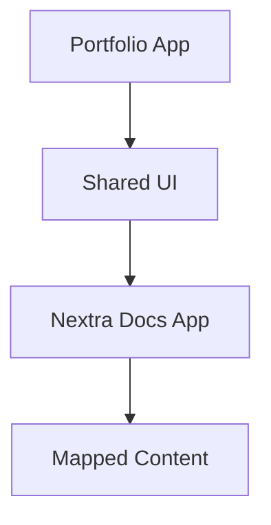

import { Playground } from 'nextra/components'

# Advanced Features

## Mermaid



## npm2yarn

```sh npm2yarn
npm i nextra nextra-theme-docs
```

## Twoslash

```ts twoslash
// @errors: 2322
const version: string = 16
```

## Playground

<Playground source={'## Live MDX from Playground\\n\\nThis is rendered on the client.'} />

## MDXRemote Example (reference)

```mdx filename="mdx-remote-example.mdx"
import { compileMdx } from 'nextra/compile'
import { MDXRemote } from 'nextra/mdx-remote'

<MDXRemote
  compiledSource={await compileMdx('# Hello {name}')}
  scope={{ name: 'DynamicFolio' }}
/>
```

## TSDoc Example (reference)

```mdx filename="tsdoc-example.mdx"
import { generateDefinition, TSDoc } from 'nextra/tsdoc'

<TSDoc
  definition={generateDefinition({
    code: `
type Config = {
  /**
   * Enables docs mode.
   * @default true
   */
  enabled?: boolean
}
export default Config`
  })}
/>
```
