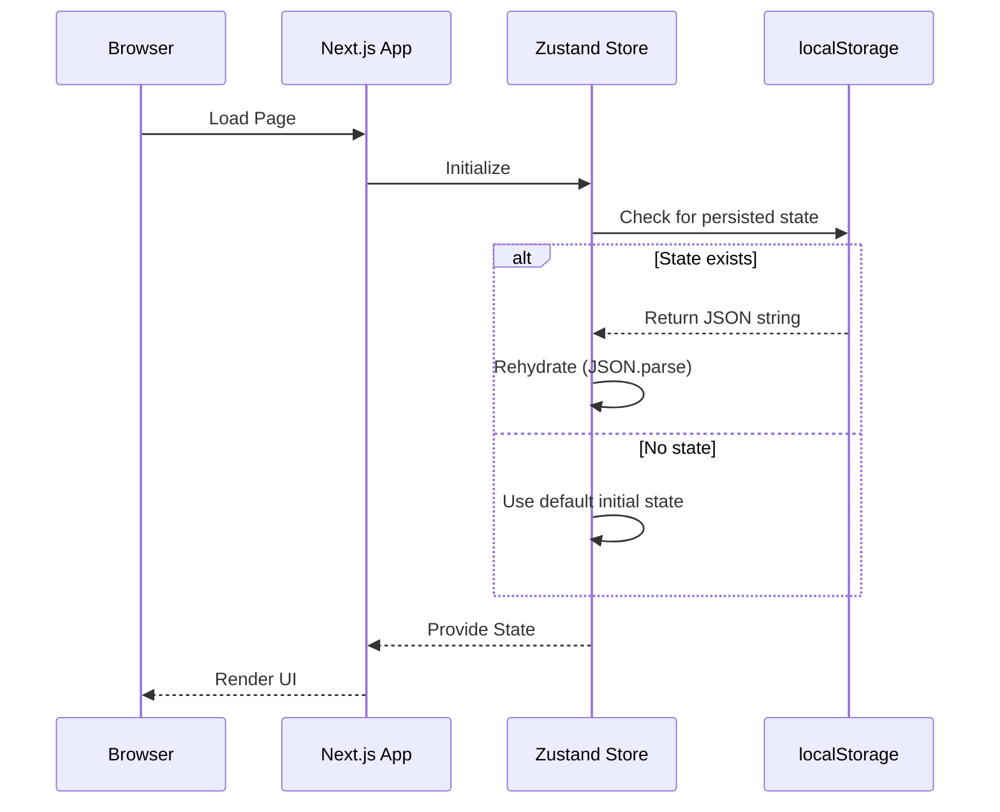
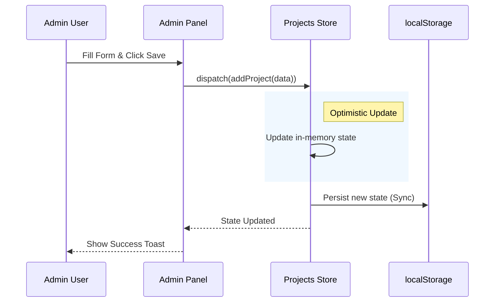
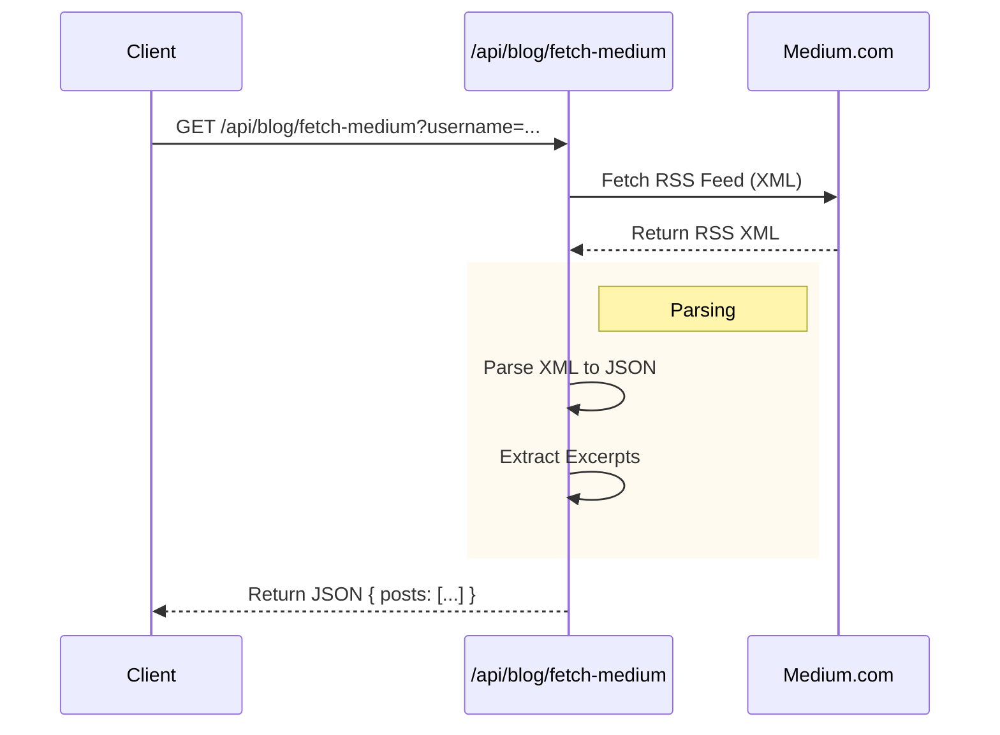

# Data Flow

Understanding how data moves through DynamicFolio CMS.

## 1. Store Hydration (Read)

When the application loads, Zustand stores rehydrate their state from `localStorage`.

## 2. Admin Update (Write)

When an admin updates content (e.g., adds a project).

## 3. External Data Fetch (Medium RSS)

Fetching blog posts from Medium.

---

> [!WARNING]
> **Hydration Mismatch**: Since `localStorage` is client-only, Server Components (RSC) cannot access this data directly during initial render. We use a `useHydration` hook to delay rendering of storage-dependent UI until the client has mounted.
