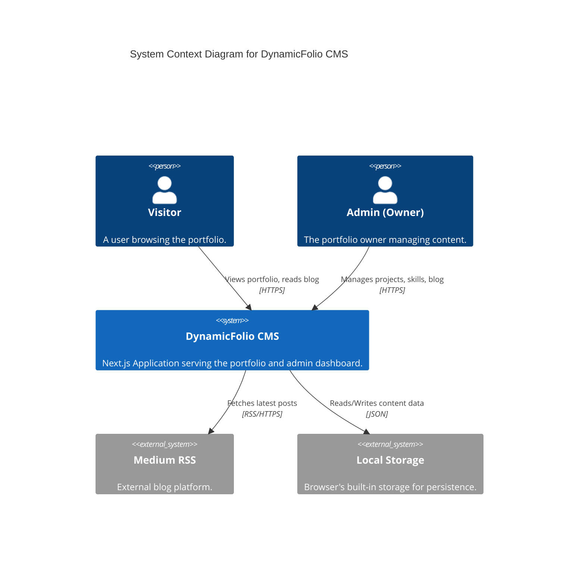

# System Overview

> [!IMPORTANT]
> This document provides a high-level view of the DynamicFolio CMS architecture using C4 model diagrams.

## Context Diagram

The **DynamicFolio CMS** is a personal portfolio and content management system designed for developers. It allows a single user (the owner) to manage content via an Admin Panel, while visitors can view the portfolio.



## Container Diagram

The system is a single Next.js application acting as both the frontend and the "backend" (via client-side logic and API routes).

```mermaid
C4Container
    title Container Diagram for DynamicFolio CMS

    Person(user, "User", "Visitor or Admin")

    Container_Boundary(app, "Next.js Application") {
        Component(client_pages, "Client Pages", "React/Next.js", "Interactive UI (Admin, Forms)")
        Component(server_pages, "Server Pages", "RSC", "Static/Dynamic Content (Home, Blog)")
        Component(api, "API Routes", "Next.js API", "Proxy for external services (Medium)")
        Component(stores, "Zustand Stores", "TypeScript", "State Management & Logic")
    }

    System_Ext(local_storage, "LocalStorage", "Persistence Layer")

    Rel(user, client_pages, "Interacts with", "HTTPS")
    Rel(user, server_pages, "Views", "HTTPS")
    
    Rel(client_pages, stores, "Reads/Writes State")
    Rel(server_pages, stores, "Reads State (via Hydration)")
    
    Rel(stores, local_storage, "Persists Data", "Sync")
    Rel(api, medium, "Fetches Data", "RSS")
```

## Key Architectural Decisions

### 1. Client-Side Persistence
- **Decision**: Use `localStorage` via Zustand `persist` middleware.
- **Why**: Zero-cost deployment, no backend required for v1.0, instant read/write.
- **Trade-off**: Data is local to the browser. Not suitable for multi-device management without export/import (or future DB sync).

### 2. Next.js App Router
- **Decision**: Use Next.js 16 App Router.
- **Why**: Leverages React Server Components (RSC) for performance on public pages, while keeping the Admin panel fully interactive with Client Components.

### 3. Tailwind CSS v4
- **Decision**: Adopt Tailwind v4.
- **Why**: Improved performance, simplified configuration (CSS-first), and future-proofing.

---

**Next Steps:**
- Explore the [[Tech Stack]](./Tech-Stack.md)
- Understand the [[Data Flow]](./Data-Flow.md)
