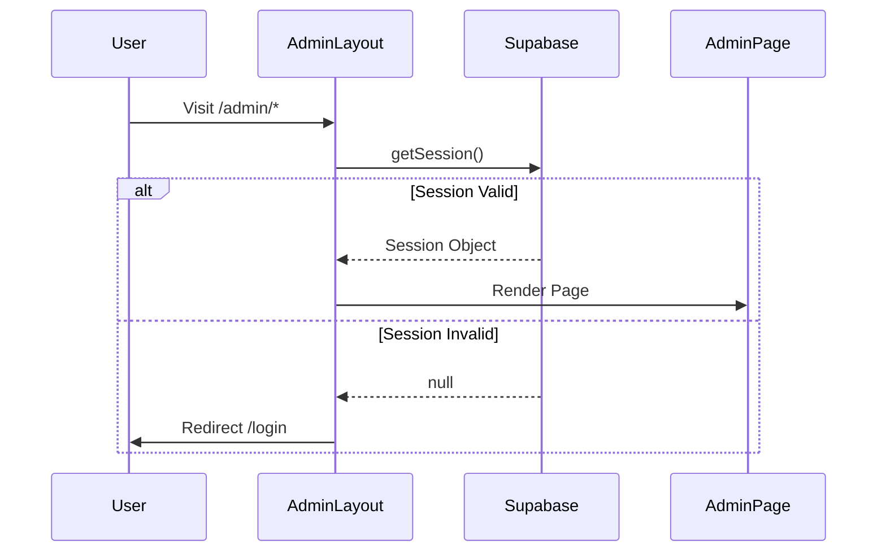

# Admin CMS Architecture

> [!IMPORTANT]
> The **Admin CMS** is the control center of the DynamicFolio. It is a protected Single Page Application (SPA) embedded within the Next.js App Router.

## 1. Authentication & Security

The Admin CMS is protected by a server-side authentication guard.

-   **File**: `src/app/admin/layout.tsx`
-   **Mechanism**: Checks for a valid Supabase session via `supabase.auth.getSession()`.
-   **Behavior**:
    -   **No Session**: Redirects to `/login`.
    -   **Valid Session**: Renders the `AdminSidebar` and children.

## 2. Layout Structure

-   **Tabs**:
    1.  **Overview**: Key metrics and charts.
    2.  **Analytics**: Detailed visitor stats (Placeholder/Future).
    3.  **Activity**: Log of recent changes.

## 4. CRUD Pattern

Most content sections (Projects, Blog, Skills) follow a standardized CRUD pattern.

### List View (`/admin/[section]`)
-   **State**: Subscribes to the relevant Zustand store (e.g., `useProjectsStore`).
-   **UI**: Renders a grid of Cards or a Data Table.
-   **Actions**: Edit (Link to `[id]`), Delete (Store Action).

### Edit/Create View (`/admin/[section]/[action]`)
-   **Component**: Uses a specific Editor component (e.g., `ProjectEditor`).
-   **Logic**:
    -   **Create**: Initializes empty form. Calls `store.add()`.
    -   **Edit**: Fetches item by ID. Calls `store.update()`.
-   **Reusable Editor**: Many sections use the generic `CMSEditor` component.

## 5. Settings Management

Global site configuration is managed in `/admin/settings`.

-   **Component**: `SiteSettings` (`src/features/admin/components/site-settings.tsx`)
-   **Store**: `useSiteSettingsStore`
-   **Tabs**:
    -   **General**: Site Name, Description, URL.
    -   **Social**: GitHub, LinkedIn, etc.
    -   **Appearance**: Theme, Primary Color (Live Preview).
    -   **SEO**: Meta tags, OG Image.
    -   **Advanced**: Debug mode, Data Export.

> [!TIP]
> The Settings page is the most complex form in the system, handling nested state updates across multiple categories.
