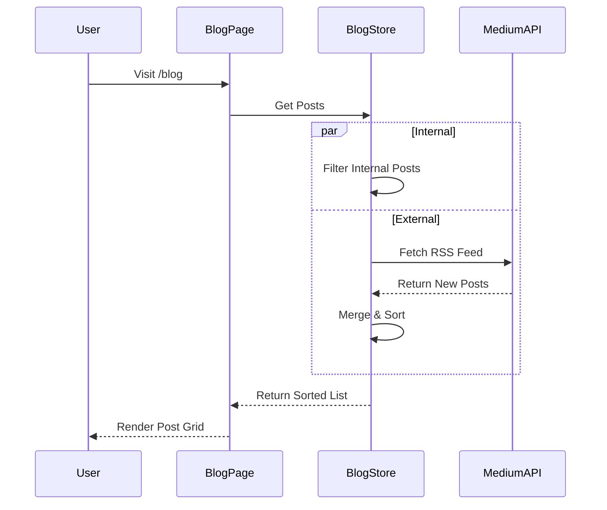

# Blog System

The blog system supports both **internal posts** (written in Markdown) and **external posts** (fetched from Medium).

- **Route**: `/blog`
- **Store**: `blog-store.ts`

## Architecture

## Features

- **Markdown Support**: Internal posts support rich text via `react-markdown`.
- **RSS Integration**: Automatically syncs with a Medium profile.
- **Tagging**: Filter posts by tags.
- **Search**: Real-time search by title/content.

## Future Improvements

- **MDX Support**: Allow React components inside blog posts.
- **Comments**: Integrate Giscus or similar.
- **Likes/Views**: Track engagement via Supabase.
