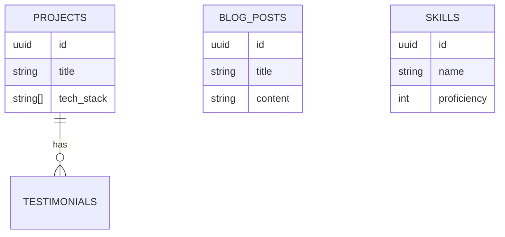

# Supabase Migration

Plan to move from `localStorage` to **Supabase** (PostgreSQL).

> [!NOTE]
> See [[DATABASE.md]](../../DATABASE.md) for the detailed migration guide and SQL schema.

## Migration Steps

1.  **Setup Project**: Create a new Supabase project.
2.  **Apply Schema**: Run the SQL script from `docs/schema/postgresql.sql`.
3.  **Env Vars**: Update `.env.local` with Supabase credentials.
4.  **Data Migration**:
    -   Create a script to read `localStorage` JSON.
    -   POST data to Supabase tables via API or SQL.
5.  **Update Stores**:
    -   Replace `persist` middleware with API calls.
    -   Example: `addProject` should call `supabase.from('projects').insert(...)`.

## Schema Overview

## Auth Integration

Once the database is connected, enable **Row Level Security (RLS)**.
- **Public**: Read-only access to published content.
- **Admin**: Full access to all tables.
